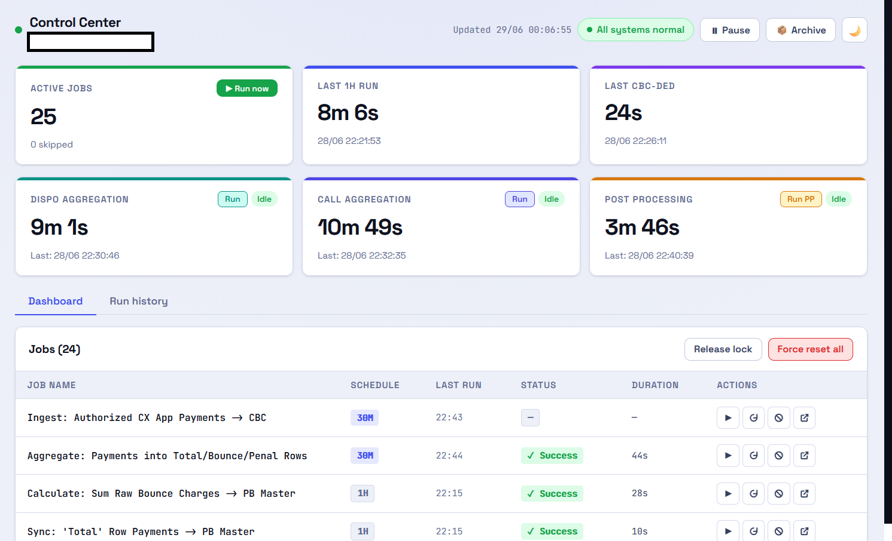
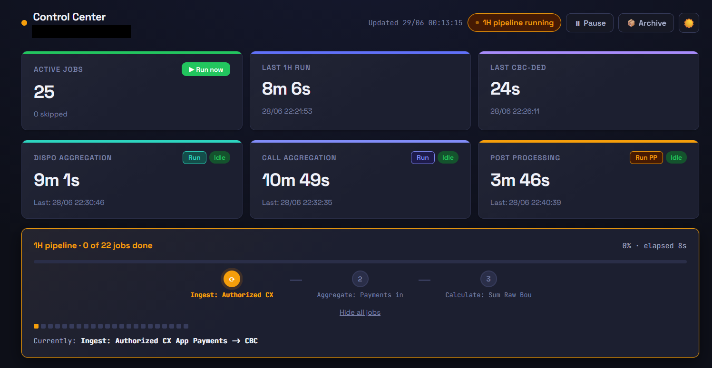
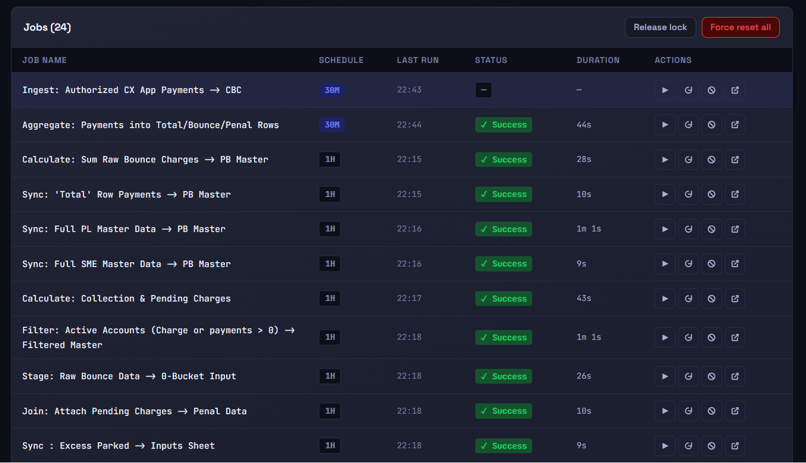
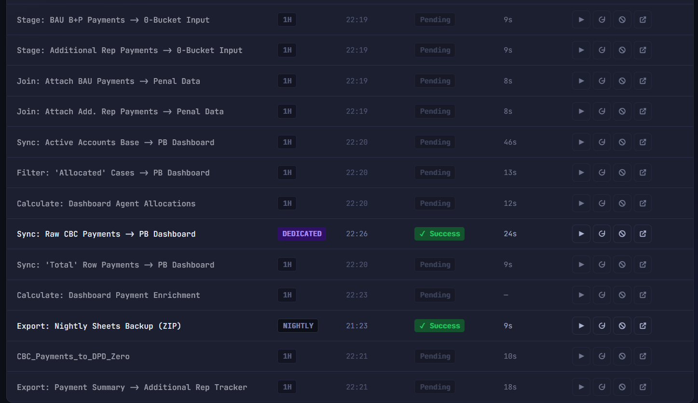
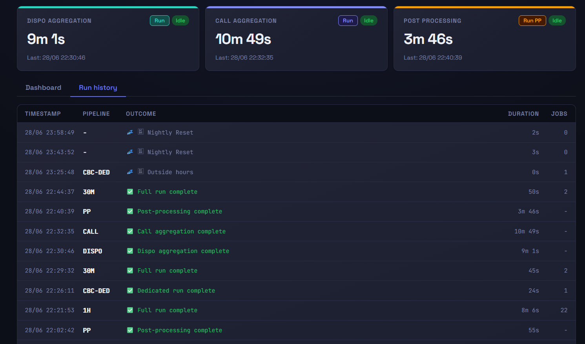
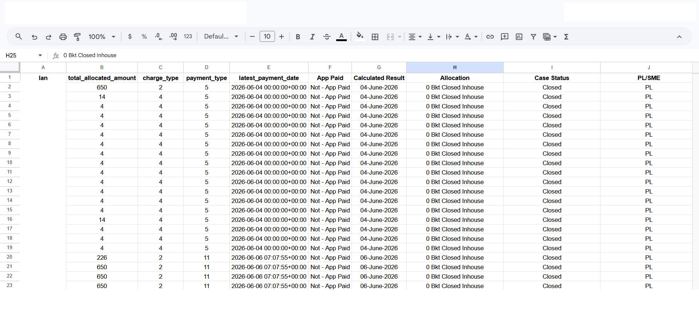

# Penal Recovery Analytics Pipeline

> A Google Apps Script data pipeline that replaced a fragile, formula-heavy Google Sheets architecture with a reliable scheduled sync engine — serving a collections operations team of ~30 people and daily reporting to C-suite leadership.

---

## The Problem

The collections analytics setup was built on Google Sheets `IMPORTRANGE` — pulling data across a dozen source sheets into consolidated views that leadership and operations used daily. On paper this worked. In practice it was brittle in a way that became increasingly costly as the data volume grew.

When an `IMPORTRANGE` breaks due to data volume, it doesn't degrade gracefully — it fails silently and takes every formula that depends on it with it. `SUMIFS`, `COUNTIFS`, and `ARRAYFORMULA` chains built on top of a broken import returned zeros or errors with no indication of which link had failed. I was the liaison between the CEO, CCO, and VP of Collections on daily recovery metrics. When my VP asked for numbers at an unscheduled moment — which happened regularly — the honest answer was sometimes "I can't tell you right now because a sheet is broken and I don't know why."

On the operational side, 25–27 telecallers and their team leaders were working directly in the same sheets to track their daily recovery rates. Heavy formula loads caused sheets to hang under concurrent users. The telecallers' workflow depended on sheets that were also under analytic load — two use cases that don't coexist well in a formula-driven spreadsheet.

The other constraint that `IMPORTRANGE` imposed: no data transformation in flight. Every aggregation, filter, and join had to be expressed as a spreadsheet formula, applied at read time, by every user simultaneously. There was no place to do the computation once and serve the result.

The specific failures this caused:
- Daily reporting to leadership was unreliable — dependent on whether imports had held overnight
- Month-start setup (new sheets, rewiring imports, formula resets) consumed a full working day every month
- Telecaller sheets hung regularly under concurrent usage, disrupting active recovery sessions
- Any schema change in a source sheet cascaded into broken formulas across dependent sheets

---

## Who This Was Built For

**Leadership (primary reporting audience):** CEO, CCO, VP of Collections — receiving daily summaries on penal charge recovery rates, collection efficiency, and team performance. Their requirement was simple: the numbers need to be there when asked for, and they need to be right.

**Operations team (~25–27 telecallers + team leaders):** Working in sheets daily to log call dispositions, track their individual daily recovery rates (DRRs), and manage their allocated lead lists. Their requirement: sheets that don't hang.

**Me, as the analytics and reporting liaison:** Building, maintaining, debugging, and explaining the system. My requirement: something I could hand over to someone else with minimal knowledge transfer if needed.

---

## What Changed

**Before:** `IMPORTRANGE` chains pulling from multiple source sheets → formula-based aggregation → dashboards that were correct when the imports held and silently wrong when they didn't.

**After:** A scheduled sync engine reads source sheets on a defined cadence, transforms and aggregates data in script, and writes clean outputs to destination sheets. Dashboards read from those outputs — they don't pull from anywhere live.

The practical outcomes:
- Month-start setup reduced from a full working day to ~2 hours
- Leadership reporting became reliable — data is either current as of the last run or the pipeline explicitly logs why it isn't
- Telecaller sheets are read-only consumers of aggregated data, no longer sharing formula load with live analytics
- Schema changes in source sheets are handled in one place (the sync engine config) rather than across every dependent formula

---

## Key Product Decisions

**1. Hourly refresh over real-time updates.**
`IMPORTRANGE` gave instant updates — when it worked. The team was accustomed to seeing numbers change live. Moving to an hourly scheduled sync meant accepting a lag in exchange for consistency and availability. This was a deliberate tradeoff: data that is always an hour old is more useful than data that is live but intermittently wrong. The hardest part of this decision wasn't technical — it was managing the expectation shift with a leadership team that had been conditioned to real-time numbers.

**2. A web app Control Center for non-technical monitoring.**
The pipeline runs as a scheduled background process. Without visibility into what it's doing, a broken run looks identical to a healthy one — you just don't get updated numbers and you don't know why. Building a monitoring UI (an HTML web app served from the same Apps Script deployment) meant that anyone — operations leads, a future team member, someone covering for me — could check pipeline health, see the last successful run, pause it if needed, and trigger a manual run, all without opening the script editor or understanding the code. The goal was minimal knowledge transfer dependency.

**3. Config-driven jobs, not hardcoded logic.**
Every sync job — which source sheet, which tab, which columns, what transformation, what schedule — is defined as a row in a configuration sheet, not in code. Adding a new data source or changing a column mapping is a spreadsheet edit, not a deployment. This was designed for a team where I was the only person who could write Apps Script: if a new source sheet needed to be wired in while I was unavailable, an operations lead with no coding background could do it.

**4. Incremental aggregation with checkpointing.**
The call log and disposition data from the telecalling platforms (TCN, Ozonetel) grows by thousands of rows daily. Re-reading the entire dataset on every run would eventually hit Google's execution limits and slow down as data accumulated month over month. Each aggregation source instead tracks where it last read to, and each run picks up only new rows. If a run is interrupted mid-source — which happens given Apps Script's 6-minute execution cap — it resumes from the checkpoint on the next trigger rather than starting over.

**5. Deduplication as a product decision, not a technical one.**
Disposition data came from two call platforms that sometimes recorded the same call. Without deduplication, the same contact attempt would be counted twice — inflating call volume metrics and distorting recovery attribution. The dedup logic (15-minute window: if both platforms logged a call for the same lead within 15 minutes, keep the primary platform's record) required an explicit decision about what "the same call" meant and whose record to trust. That decision had to be made with input from operations, not inferred from the data.

**6. Monthly sheet rotation for data volume management.**
Google Sheets has a 10 million cell limit per spreadsheet. Accumulating a full year of call logs and disposition data in one sheet would eventually hit that wall. Moving to a fresh sheet per month — with the pipeline automatically pointing to the current month's sheet — keeps each sheet well within limits and creates a natural archive structure. The cost: month-end requires a two-step reset process. The benefit: the system doesn't silently degrade as data grows.

---

## Architecture

```
[Call Center Platforms]          [Source Sheets]
  TCN (dispositions + calls)       Routing_Config (job definitions)
  Ozonetel (calls)                 Post_Sentinel tab (agg sources)
         │                                │
         ▼                                ▼
  triggerSentinel()           triggerDispoAggregation()
  [hourly cron]               [every 10 min]
    └── Sync Engine               └── N TCN dispo sources
        reads Routing_Config          → filter to allocated leads
        runs all scheduled jobs       → 15-min window dedup
        (copy, filter, aggregate,     → Combined_Dispo_Logs
         lookup joins, payment             ↓
         summaries)             triggerCallAggregation()
                                [every 5 min]
                                    └── Ozonetel + TCN call sources
                                        → filter by allocation date
                                        → Combined_Call_Logs
                                        → cross-source anomaly scan
                                             ↓
                                    triggerPostProcessing()
                                    [every 5 min, after both above complete]
                                        └── penal metrics → base data sheet
                                            (attempts, answered, talk time,
                                             last call date, best/last disposition)

[Control Center Web App]
  Pipeline status + last run times
  Manual run / pause / resume
  Per-job health and error log
  Accessible to non-technical team members
```

**Runtime:** Google Apps Script (V8), Google Sheets API v4. No external database — state is persisted in Script Properties. Deployable via `clasp`.

---

## Screenshots

### Control Center — Dashboard view
The main monitoring UI showing 25 active jobs, last run times for the hourly pipeline, and the three sub-engines (dispo aggregation, call aggregation, post-processing) with their individual run status.



### Control Center — Pipeline running live
The pipeline mid-execution, showing the active job progress bar, current job name, and the "1H pipeline running" status indicator.



### Job list — config-driven design
Every sync job defined as a row: job name, schedule (1H / 30M / DEDICATED / NIGHTLY), last run time, status, and duration. Adding a new data source is a row addition — no code change required.



### Job list — full schedule view
Scrolled down showing the full range of job types and schedules, including dedicated payment sync, nightly backup export, and dashboard enrichment jobs.



### Run history
Audit log of every pipeline execution — timestamp, which pipeline ran (1H / 30M / CALL / DISPO / PP), and outcome. Useful for diagnosing gaps in data freshness.



### Sample output — payment summary sheet
A sample of the aggregated payment output written by the pipeline to the destination sheet, showing charge type and payment method breakdown per lead.



---

### File Map

| File | Purpose |
|---|---|
| `scheduler.js` | Core orchestrator — reads config, routes jobs, manages relay/resume and semaphores |
| `sheet_sync.js` | Copy, filter, lookup-join, and sum-join job handlers |
| `payment_aggregation.js` | Aggregates raw payments into per-lead collection summaries |
| `data_inputs.js` | Conditional base data updates (RAM-map approach) |
| `dashboard_calc.js` | Dashboard and allocation calculation jobs |
| `dispo_aggregation.js` | Incremental disposition log aggregation + deduplication |
| `call_aggregation.js` | Incremental call log aggregation + cross-source anomaly scan |
| `post_processing.js` | Penal metrics, discounts, and daily inputs from aggregated logs |
| `vintage_views.js` | Vintage charge analysis — View 2 → View 3 waterfall allocation |
| `vintage_backend.js` | Backend for the Vintage Views web app |
| `validation.js` | Config validator, header alignment checker, source freshness alerts |
| `control_center_backend.js` | Control Center web app backend (state, job status, run history) |
| `setup_tools.js` | Trigger installation, developer utilities, month-end reset tools |
| `daily_export.js` | Daily base data export job |
| `utils.js` | Shared utilities — parsing, MD5 hashing, batching, exponential backoff |
| `control_center.html` | Monitoring UI — real-time pipeline status, manual run/pause controls |
| `vintage_views.html` | Vintage analysis web app UI |

---

## Vintage Charge Analysis

Alongside the live recovery pipeline, the system includes a separate charge vintage analysis that the CEO's office, Finance, and Strategy teams use to assess recoverability of ageing outstanding charges.

**What "vintage" means here:** every bounce charge and penal charge levied on a borrower is bucketed by age — how long it has been outstanding — across five bands: 0–3 months, 4–6 months, 7–12 months, 13–24 months, and 24+ months. Three views of the same data are tracked:

- **Accrued** — the gross amount levied (regardless of whether it has been paid or waived)
- **Paid** — how much has actually been collected against each vintage bucket
- **Outstanding** — what remains unpaid after payments and waivers

The primary business question this answers: *can we recover older outstanding charges with better waiver policies, or has the collection window for those buckets effectively closed?* Comparing the paid-to-accrued ratio across vintage bands gives the strategy team a data-backed basis for recommending waiver thresholds by age.

**How it works:**

```
[Source Sheets]                          [Vintage Master Sheet]
  Charge accrual data        ──────────►   View 1: Raw accrued/paid/outstanding
  Payment records                               │
                                                ▼
                                          generateVintageViews()   [manual trigger]
                                               │
                                    ┌──────────┴──────────┐
                                    ▼                     ▼
                               View 2                  View 3
                         (waterfall allocation    (final allocated
                          by vintage band)         recovery view)
```

View 2 applies a waterfall allocation — payments are applied to the oldest outstanding charges first, then progressively to newer ones. View 3 shows the result after allocation: how much of each vintage band has been effectively recovered vs. remains exposed. This is the view shared with leadership for waiver policy discussions.

---

## Scale

The pipeline manages sync jobs across more than a dozen source–destination sheet pairs, running hourly. The post-sentinel aggregation engines process disposition and call log data from multiple telecalling platform exports — each source sheet accumulating tens of thousands of rows per month. Data for each month is isolated in a dedicated Google Sheet to stay within platform cell limits.

---

## Setup

### Prerequisites
- [Node.js](https://nodejs.org/) and [clasp](https://github.com/google/clasp) installed
- A Google account with Apps Script enabled

### Steps

1. **Clone and link to Apps Script**
   ```bash
   git clone <repo-url>
   cd recovery-analytics-pipeline
   clasp login
   clasp create --type sheets --title "Recovery Pipeline"
   ```

2. **Configure sheet IDs** in `scheduler.js`:
   ```js
   const CONTROL_CENTER_ID    = "YOUR_CONTROL_CENTER_SHEET_ID";
   const FALLBACK_ALERT_EMAIL = "your-email@example.com";
   ```
   And in `vintage_views.js` / `vintage_backend.js`:
   ```js
   const VINTAGE_VIEW2_ID  = "YOUR_VINTAGE_VIEW2_SHEET_ID";
   const VINTAGE_VIEW3_ID  = "YOUR_VINTAGE_VIEW3_SHEET_ID";
   const VINTAGE_MASTER_ID = "YOUR_VINTAGE_MASTER_SHEET_ID";
   ```

3. **Push and set up triggers**
   ```bash
   clasp push
   ```
   Then run `setupTriggers()` once from the Apps Script editor.

4. **Set up the Post_Sentinel config tab** — run `setupPostSentinelTab()`, fill in source sheet IDs, activate sources.

5. **Create the first monthly agg sheet**
   ```javascript
   createMonthlyAggSheet("Jan'26")
   ```

---

## Developer Reference

```javascript
// Force an immediate pipeline run (bypasses hourly schedule)
forceRunSentinel()

// Test a single sync job (set row number in cell Q2 of Control Center first)
testSingleJob()

// Month-end reset — run both steps in order
clearAllProperties()
createMonthlyAggSheet("Feb'26")

// Diagnostics
validateRoutingConfig()        // check all job config rows before deploying changes
selfHealStuckStates()          // clear orphaned locks / stuck flags
checkSourceFreshness()         // verify source sheets are being updated as expected
validateDestinationHeaders()   // catch column mismatches before they cause silent errors

// Force reprocess a single aggregation source (or use the Force Reset checkbox in the UI)
forceReprocessDispoSource("TCN_DISPO_1")
forceReprocessCallSource("TCN_CALLS_1")
```

---

## What I Would Do Differently

**Structured alerting instead of email fallback.** When a run fails or a source sheet stops updating, the current system sends an email. That's fine but easy to miss in a busy inbox. A proper alert channel — even just a dedicated Slack message or a flag in the Control Center — would surface issues faster.

**User-facing data freshness indicators.** The operational team sees updated numbers but has no way to know *when* those numbers were last refreshed without checking the Control Center. Embedding a "last updated" timestamp directly in the output sheets would remove that ambiguity and reduce "are the numbers current?" questions.

**Separating the telecaller-facing sheets from the analytics outputs earlier.** This was done incrementally — some sheets were migrated off formulas before others. The transition period, where some sheets were still on `IMPORTRANGE` and others weren't, was confusing for users and created inconsistencies in the daily numbers. A cleaner cutover would have been harder to coordinate but easier to explain.

**A test environment.** All changes are tested against production data in production sheets. A parallel set of test sheets with a subset of real data would make it much safer to iterate on the sync logic without risking a broken run during a live reporting window.
